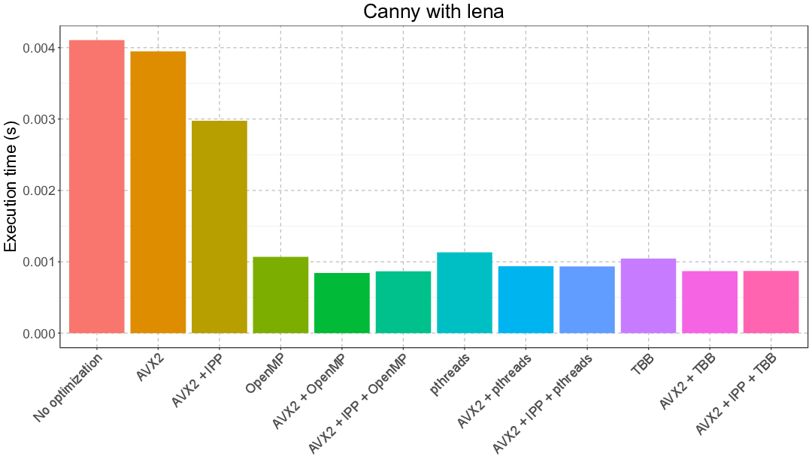
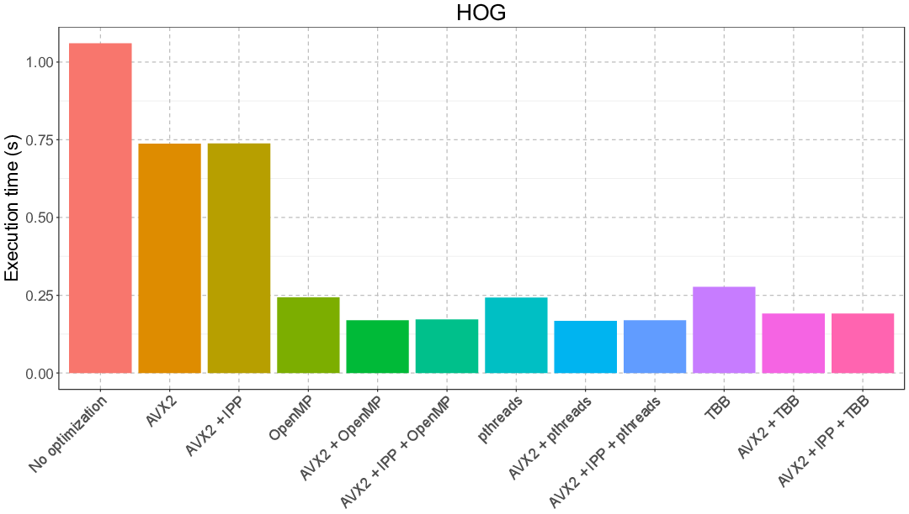
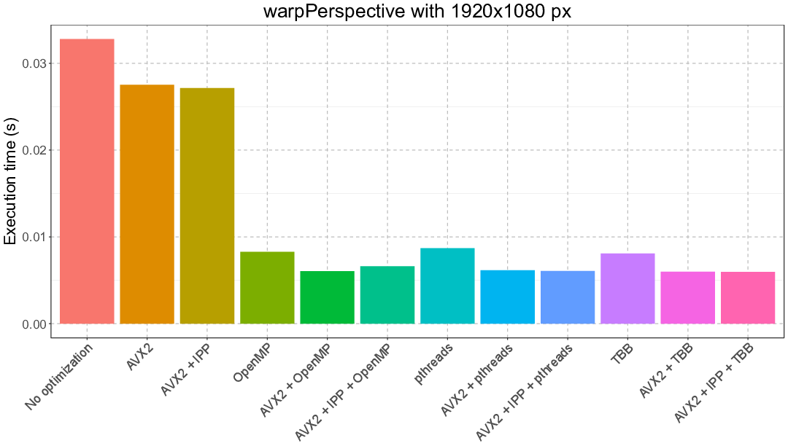

This code is part of a group project I did for a class.
Commit history is not present to remove all references to the class itself.
My main contributions were writing the tests and the scripts to compile the many versions of OpenCV.
I also ran the tests and generated the plots using R.

---

## Experimental setup

We focused our OpenCV benchmark on the impact of the three optimizations listed below.
Since IPP is highly dependent on AVX2, we did not benchmark IPP without AVX2.
In total, we tested 11 optimization setups and one scenario with no optimization.
We selected three OpenCV functions to benchmark.

**Optimizations**

- AVX2
- IPP
- Parallel frameworks
  - OpenMP
  - pthreads
  - TBB

**Functions**

- Canny
- detectMultiScale in HOGDescriptor class
- warpPerspective

## Some results

